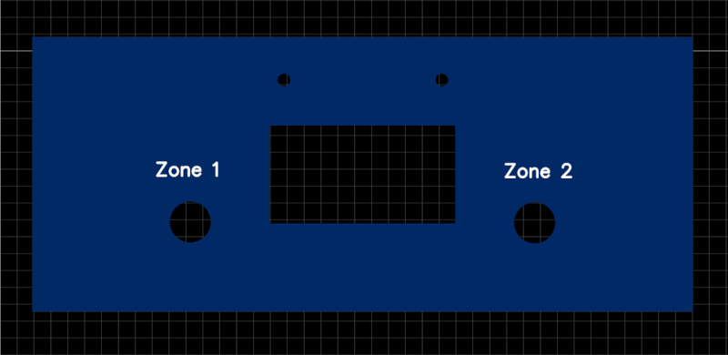
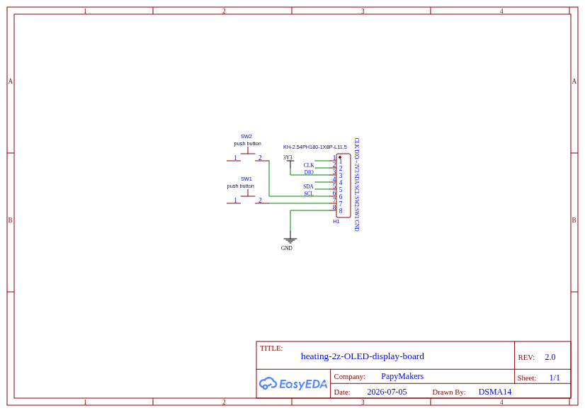

🇫🇷 **Français** | [🇬🇧 English](README.md)

# Heating 2Z — Kit d'affichage OLED (option 2)

Kit PCB d'affichage **OLED I2C** pour le [gestionnaire de chauffage 2 zones ESP32-C6](https://github.com/Papymakers/esp32-heating-2z).  
Seconde option d'affichage, alternative au [kit TM1637 + bargraphe LEDs](https://github.com/Papymakers/heating-2z-display-board).

Composé de **2 cartes PCB + 1 nappe FLEX-PCB 8 pistes**, montées dans un boîtier **DIN rail 6 modules**.

## Une interface quasi universelle

Le connecteur 8 broches véhicule simultanément les signaux **TM1637** (CLK/DIO), le bus **I2C** (SDA/SCL), deux **switches** et l'alimentation. La même carte façade peut donc recevoir :

- un afficheur **OLED 0.96" SSD1306 I2C** (ce kit),
- ou un afficheur **TM1637** 4 digits (kit option 1),

et s'adapte à **la plupart des montages en boîtier DIN 6 modules** : gestionnaire de chauffage, horloge, thermostat, monitoring… Il suffit de router les 8 signaux sur la carte principale.

## Contenu du kit

| Carte | Rôle |
|-------|------|
| **Façade** (front panel, sans pistes) | Face avant mécanique : fenêtre OLED + 2 perçages boutons |
| **Carte afficheur / switches** (H-H-C V4 front panel) | Support OLED (embase 4 broches), 2 switches tactiles, connecteur ZIF, header 8 broches |
| **Nappe FLEX-PCB 8 pistes** | Liaison souple carte principale ↔ carte afficheur, pas 2.54 mm — voir [`flex-pcb-8-tracks-254`](https://github.com/Papymakers/flex-pcb-8-tracks-254) |

## Nomenclature (BOM) — connectique et commande

Toutes les références sont des **références constructeur**, disponibles chez **Mouser**.

| Repère | Composant | Constructeur | Référence | Réf. Mouser | Qté |
|--------|-----------|--------------|-----------|-------------|-----|
| J-OLED | Embase femelle 4 contacts, 2.54 mm, coudée, dorée (série White Lite BG302) | GCT | **BG302&#8209;04&#8209;A&#8209;L&#8209;G** | 640&#8209;BG302&#8209;04&#8209;A&#8209;L&#8209;G | 1 |
| J-ZIF | Connecteur FFC ZIF-LINE, 8 positions, pas 2.54 mm (.100"), traversant | TE Connectivity | **487925&#8209;1** | 571&#8209;487925&#8209;1 | 1 ou 2* |
| SW1, SW2 | Switch tactile 6×6 mm, poussoir saillant, série B3F | Omron | **B3F&#8209;3150** | 653&#8209;B3F&#8209;3150 | 2 |
| — | Capuchon rond noir Ø6 mm pour B3F poussoir saillant | Omron | **B32&#8209;2010** | 653&#8209;B32&#8209;2010 | 2 |
| U-DISP | Module OLED 0.96" SSD1306, I2C, 4 broches (GND/VCC/SCL/SDA) | générique | — | — | 1 |

\* 2 connecteurs ZIF si la carte principale reçoit elle aussi la nappe en ZIF (un à chaque extrémité).

## Connecteur 8 broches (H1)

Header **KH-2.54PH180-1X8P-L11.5** (1×8, pas 2.54 mm) — signaux véhiculés par la nappe :

| Signal | Fonction |
|--------|----------|
| +3V3 | Alimentation afficheur + pull-ups |
| CLK | TM1637 (option 1) |
| DIO | TM1637 (option 1) |
| SDA | I2C OLED (option 2) |
| SCL | I2C OLED (option 2) |
| SW1 | Bouton zone 1 |
| SW2 | Bouton zone 2 |
| GND | Masse |

> L'ordre exact des broches est celui du schéma EasyEDA rev 2.0
> (`hardware/schematic/schematic_oled_display_board.png`).

## Schéma

*heating-2z-OLED-display-board — rev 2.0 — 2026-07-05 — EasyEDA*

## Documentation matérielle

Voir [`hardware/README.fr.md`](hardware/README.fr.md) pour le détail des cartes, de la nappe FLEX et du montage.

## Boîtier

DIN rail **6 modules** (105 mm) — identique au kit option 1.

## Commander des cartes

Les fichiers Gerber et sources EasyEDA ne sont pas publiés : les PCB (nus, en kit ou assemblés) sont vendus sur [papymakers.com](https://papymakers.com).

| Option | Contenu | Prix indicatif |
|--------|---------|----------------|
| **Kit OLED** | 2 PCB (façade + carte afficheur/switches) + nappe FLEX 8 pistes | 15€ |

*Frais de port inclus. Expédition depuis la France.*

## Projets liés

- [`esp32-heating-2z`](https://github.com/Papymakers/esp32-heating-2z) — gestionnaire de chauffage 2 zones ESP32-C6 (carte principale)
- [`heating-2z-display-board`](https://github.com/Papymakers/heating-2z-display-board) — kit d'affichage option 1 : TM1637 + bargraphe LEDs
- [`flex-pcb-8-tracks-254`](https://github.com/Papymakers/flex-pcb-8-tracks-254) — nappe FLEX-PCB 8 pistes utilisée par ce kit

## Licence

Documentation publiée sous licence **CC BY-SA 4.0**.

---

**Papy Makers** — [papymakers.com](https://papymakers.com) — Normandie, France
