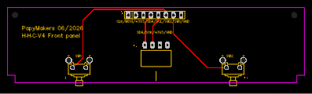

[🇫🇷 Français](README.fr.md) | 🇬🇧 **English**

# Hardware — 2-zone OLED display kit

## Overview

The kit consists of two rigid PCBs linked to the main board by a FLEX-PCB
8-track ribbon, the whole assembly mounted in a 6-module DIN rail enclosure
(105 mm).

```
Main board (esp32-heating-2z)
        │
        │  FLEX-PCB 8-track ribbon, 2.54 mm pitch
        │  (TE 487925-1 ZIF at each end)
        ▼
Display / switches board (H-H-C V4 front panel)
        │  GCT BG302-04-A-L-G header (OLED)
        │  2 × Omron B3F-3150 + B32-2010 keycaps
        ▼
Front panel (no traces)
```

## 1. Front panel


- **Purely mechanical** PCB, no traces
- Rectangular window for the 0.96" OLED display
- 2 holes for the switch keycaps to pass through
- PapyMakers 06/2026 silkscreen

## 2. Display / switches board (H-H-C V4 front panel)



Components:

| Ref | Component | Part number |
|-----|-----------|-------------|
| J-OLED | Female header, 4 contacts, 2.54 mm, right-angle, gold | GCT **BG302-04-A-L-G** |
| J-ZIF | FFC ZIF-LINE connector, 8 positions, 2.54 mm, through-hole | TE Connectivity **487925-1** |
| SW1, SW2 | Tactile switch 6×6 mm, projected plunger | Omron **B3F-3150** |
| — | Round black keycap Ø6 mm | Omron **B32-2010** |
| H1 | Header 1×8, 2.54 mm, L11.5 | KH-2.54PH180-1X8P-L11.5 |

The OLED display (SSD1306 module, 4 pins GND/VCC/SCL/SDA) plugs into the
right-angle BG302 header: it sits parallel to the PCB, flush with the front
panel window.

### Fitting the keycaps

> ⚠️ Fit the **B32-2010 keycaps after soldering** the switches — soldering
> heat may deform them (Omron recommendation).

## 3. FLEX-PCB 8-track ribbon


- **8 tracks**, **2.54 mm** (.100") pitch, compatible with TE 487925-1 ZIF-LINE
- Reinforced ends, contacts exposed on one side
- Flexible link main board ↔ display board: allows the front panel to be
  positioned independently of the main board inside the DIN enclosure

Signals carried: +3V3, CLK, DIO, SDA, SCL, SW1, SW2, GND
(see pinout in the [main README](../README.md)).

Dedicated repo: [`flex-pcb-8-tracks-254`](https://github.com/Papymakers/flex-pcb-8-tracks-254)
(dimensions 71.1 × 22.9 mm, single-sided).

## Schematic


*heating-2z-OLED-display-board — rev 2.0 — 2026-07-05 — EasyEDA design, JLCPCB fabrication*

## Universality

The same front panel + display board pair suits most 6-module DIN rail
assemblies: the 8-pin connector routes TM1637 (CLK/DIO), I2C (SDA/SCL) and
two switches at once. Only the host project's main board needs to expose the
ZIF connector or a compatible 2.54 mm header.

## Enclosure

DIN rail **6 modules** (105 mm).
